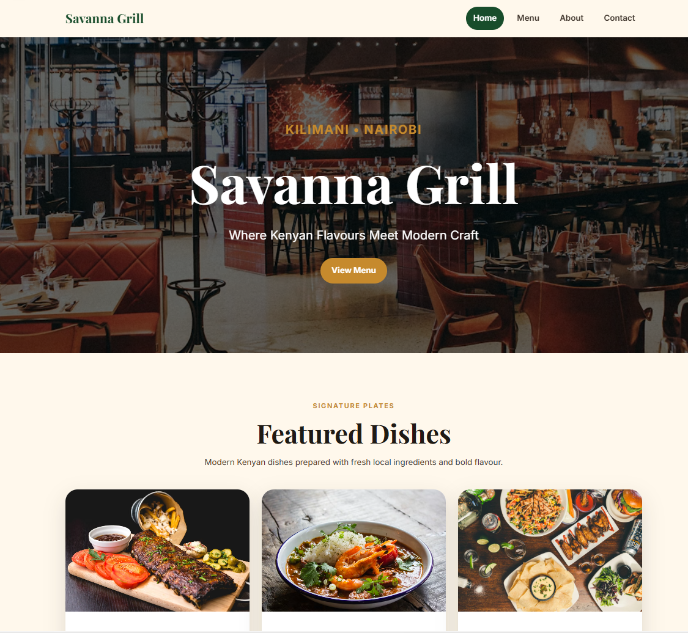
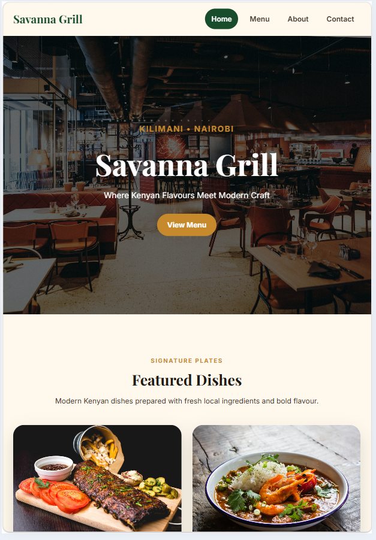
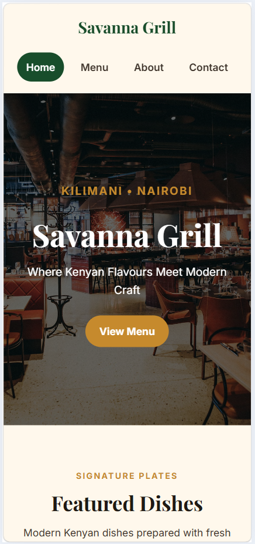

# Savanna Grill Restaurant Website

A responsive multi-page restaurant website for Savanna Grill, a fictional Kenyan-inspired restaurant located on Ngong Road in Kilimani, Nairobi.

## Pages

- Home page: hero section, featured dishes, special offer, why us section, and gallery
- Menu page: breakfast, lunch, dinner, and drinks sections with prices in KES
- About page: restaurant story, team section, and values
- Contact page: contact information, opening hours, form, and embedded map

## Tech Stack

- HTML5
- CSS3
- Flexbox
- CSS Grid
- Responsive design
- GitHub Pages

## Live URL

## Screenshots

### Desktop View

### Tablet View

### Mobile View

